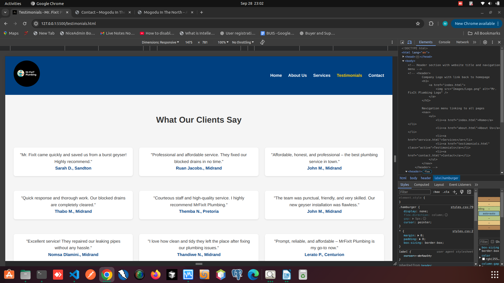
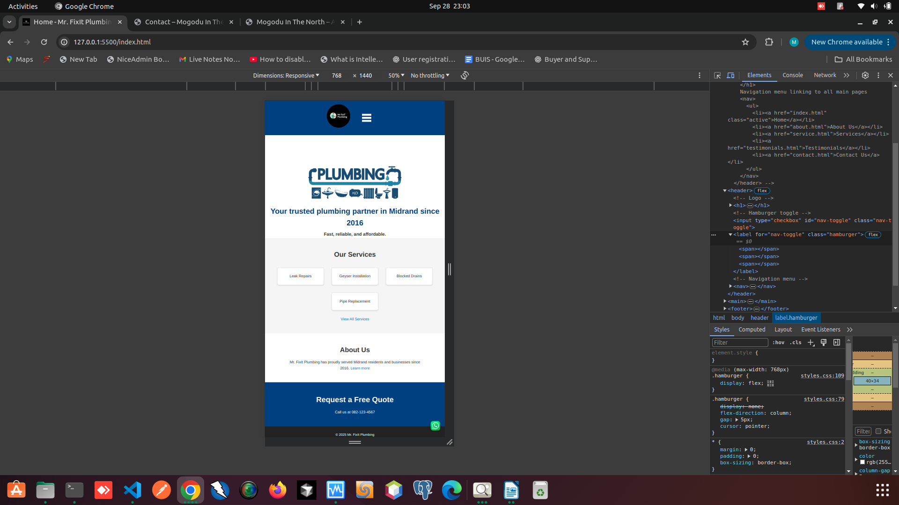
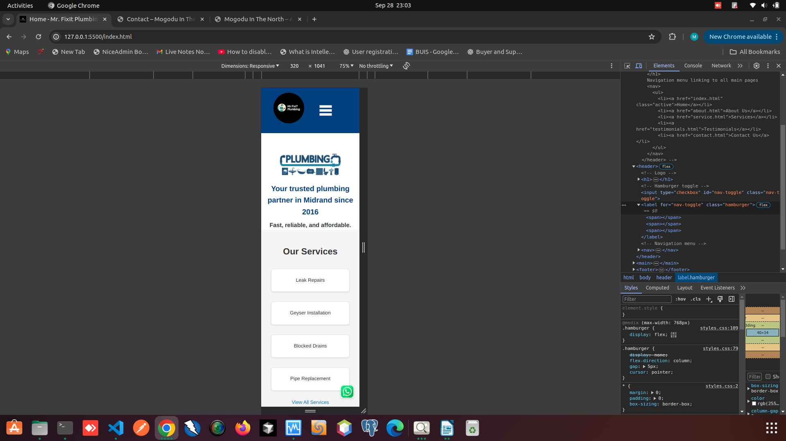
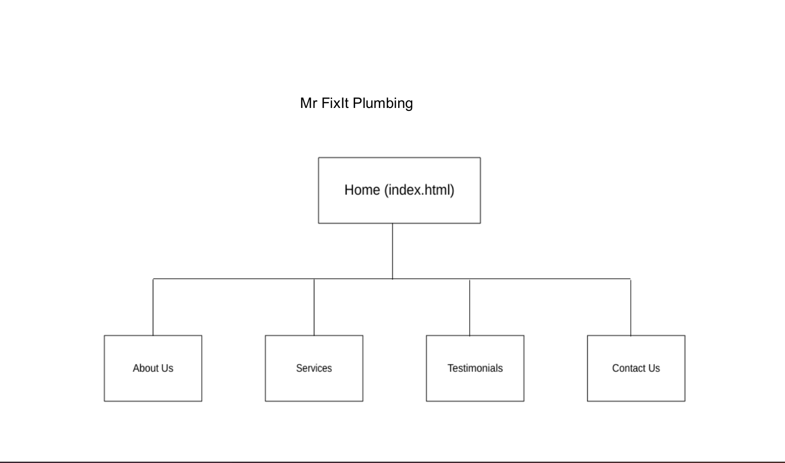
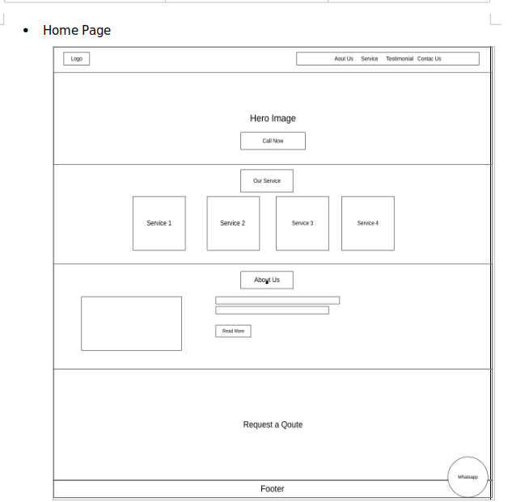
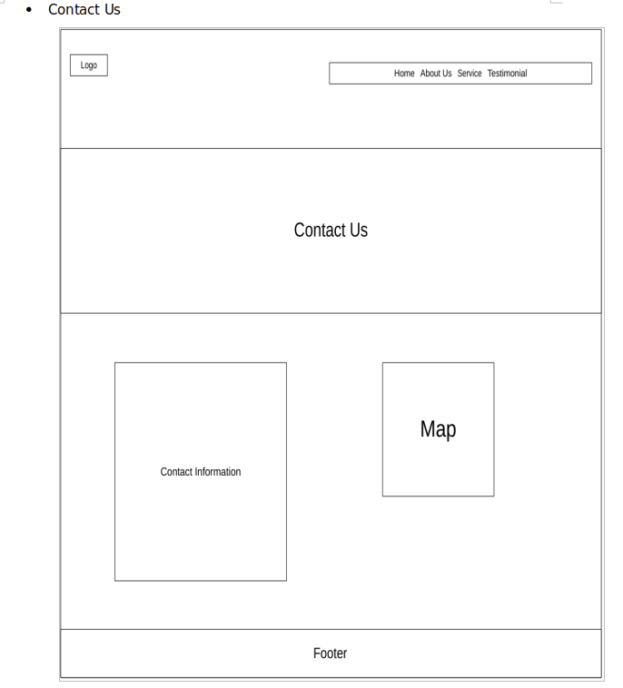
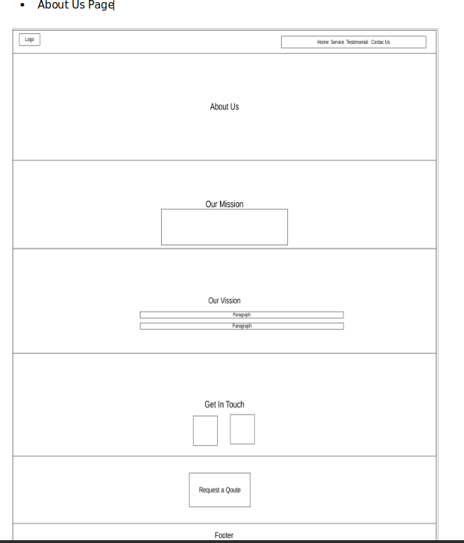
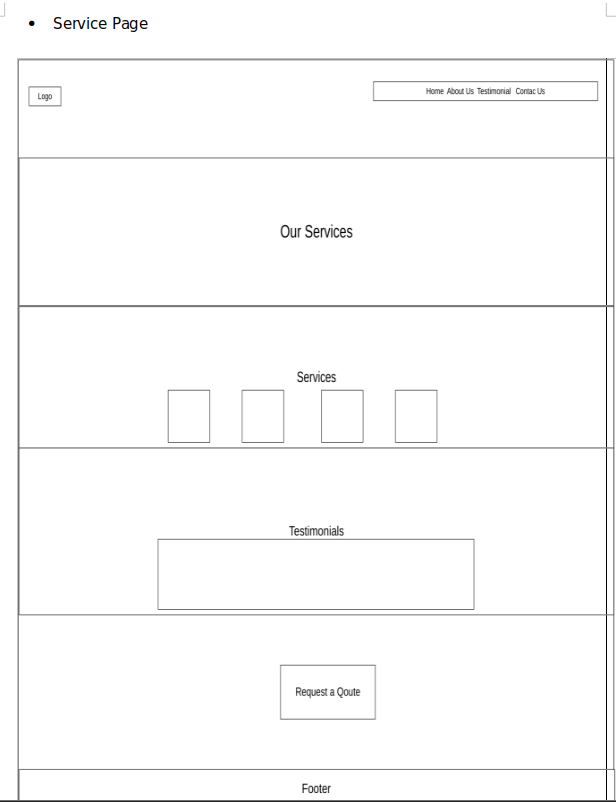
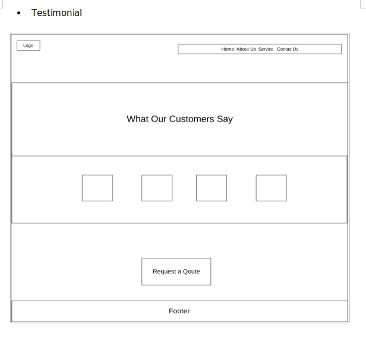

# Mr. FixIt Plumbing Website

## Cover Page
**Name:** Muano Nevhufumba  
**Student Number:** ST10468752  
**Subject & Code:** Web Development (Introduction) WEDE5020  
**Group:** Group 1  
**Date:** 27 August 2025  

---

## Table of Contents
1. [Organisation Overview](#organisation-overview)  
2. [Website Goals and Objectives](#website-goals-and-objectives)  
3. [Current Website Analysis](#current-website-analysis)  
4. [Proposed Website Features and Functionality](#proposed-website-features-and-functionality)  
5. [Design and User Experience](#design-and-user-experience)  
6. [Technical Requirements](#technical-requirements)  
7. [Timeline and Milestones](#timeline-and-milestones)  
8. [Budget](#budget)  
9. [Changelog](#changelog)  
10. [GitHub Commit & Code Documentation Guidelines](#github-commit--code-documentation-guidelines)  
11. [Screenshots](#screenshots)  
12. [Site Map & Wireframes](#site-map--wireframes)  
13. [References](#references)  


## Organisation Overview

### Name
Mr. FixIt Plumbing  

### Brief History
Mr. FixIt Plumbing is a family-run plumbing business established in 2016, servicing Midrand and surrounding suburbs.  

### Mission and Vision Statements
**Mission:** Provide reliable, high-quality plumbing services to local households and businesses.  
**Vision:** Become the leading plumbing service provider in Midrand with a trusted online presence.  

### Target Audience
Local homeowners, property managers, and small businesses in Midrand and nearby suburbs. Target audience mainly aged 25–55, seeking reliable and professional plumbing services.  


## Website Goals and Objectives

### Goals
- Generate service inquiries through the website.  
- Showcase services clearly to potential clients.  
- Highlight customer testimonials to build trust.  

### Key Performance Indicators (KPIs)
- Receive 20+ contact form submissions per month.  
- Rank in the top 3 Google results for “plumber in Midrand.”  
- Increase phone call inquiries from the website by 40%.  


## Current Website Analysis

Since Mr. FixIt Plumbing currently does not have a website, the business has no online presence.  
**Areas for Improvement:**  
- Establish online visibility.  
- Improve local SEO to attract new clients.  
- Provide clear contact information and an easy way for customers to request quotes.  


## Proposed Website Features and Functionality

**Home Page:** Hero section, service preview, testimonials, call-to-action buttons.  
**About Us Page:** Company overview, mission, vision, team introduction.  
**Services Page:** Detailed services (leak repairs, geyser installation, blocked drains, pipe replacement).  
**Testimonials Page/Section:** Customer reviews with names and ratings.  
**Contact Page:** Embedded Google Maps, phone, email, office locations, social media links, simple contact form.  

*Note:* All features are front-end only; no backend-heavy functionality is included.  


## Design and User Experience

### Colour Scheme
- #0A74DA (Deep Blue)  
- #E6F7FF (Light Blue)  
- #FFFFFF (White)
- #dddddd (White)  
- #333333 (Dark Grey)  
- #FFCC00 (Accent Yellow)  

### Typography
- Headings: Roboto Bold  
- Body: Roboto Regular  

### Layout and Design
- Simple, one-scroll design optimized for mobile usability (W3Schools, 2025).  
- Use of Flexbox and CSS Grid for layout (Mozilla Foundation, 2025a; 2025b).  

### User Experience Considerations
- Sticky “Call Now” button.  
- Quick quote form on every page.  
- WhatsApp integration for instant contact.  

### Wireframes
*Low-fidelity wireframes illustrate content structure/layout for all pages (not full design).*  
- **Home Page:** Hero section, services, testimonials, CTA  
- **About Page:** Mission, vision, team  
- **Services Page:** Service descriptions, images  
- **Contact Page:** Map, contact form, social links  

## Technical Requirements
- **Domain:** www.mrfixitplumbing.co.za  
- **Hosting:** Shared hosting (Xneelo, 2024; Afrihost, 2024)  
- **Languages:** HTML, CSS, JavaScript  
- **Frameworks:** Bootstrap 5 (Bootstrap, 2024)  


## Timeline and Milestones

| Week / Date | Learning Unit | Task / Activity | Milestone / Submission |
|-------------|---------------|----------------|----------------------|
| 21–25 Jul   | Week 1        | Requirement gathering, research, write goals | ICE 1 |
| 28 Jul–01 Aug | Week 2      | Wireframing, UI/UX planning | ICE 2 |
| 04–08 Aug   | Week 3        | HTML structure creation | ICE 3 |
| 11–15 Aug   | Week 4        | Content addition, README creation, GitHub commits | ICE 4 |
| 25–29 Aug   | Week 5        | CSS styling, implement Part 1 feedback | Part 1 Submission |
| 01–05 Sep   | Week 6        | Continue CSS styling | - |
| 08–12 Sep   | Week 7        | Responsive web design | - |
| 15–19 Sep   | Week 8        | GitHub commits, README updates | - |
| 06–10 Oct   | Week 9        | JavaScript functionality, dynamic content | - |
| 13–17 Oct   | Week 10       | SEO on-page and off-page | - |
| 20–24 Oct   | Week 11       | Form validation, HTML forms | - |
| 27–31 Oct   | Week 12       | Deploy website, final commits | Hosting setup |
| 03–07 Nov   | Summative Week | Final testing and presentation | Maintenance planning |


## Budget
- Domain and Hosting: R1,000/year  
- Development & Design: Student effort (R0)  
- Maintenance (Annual): R1,200  
**Total Estimated Cost:** R2,200  


## Changelog

- **v1.0 – 27 Aug 2025:** Initial commit; folder structure and HTML pages (index, about, service, testimonial, contact)  
- **v1.1 – 28 Aug 2025:** Fixed hero section padding; added testimonial names; updated contact layout  
- **v1.2 – 30 Aug 2025:** Linked external CSS; applied base styles and typography  
- **v1.3 – 02 Sep 2025:** Implemented Flexbox and Grid layout; added hover effects; adjusted responsive design  
- **v1.4 – 05 Sep 2025:** Updated navigation bar with hamburger menu; added responsive footer  
- **v1.5 – 10 Sep 2025:** Styled Home page; implemented responsive design with media queries  
- **v1.6 – 27 Sep 2025:** Styled About Us page with responsive layout
- **v2.0 – 27 Sep 2025:** Updated README with new information and reorganized HTML structure of all pages  
- **v1.7 – 27 Sep 2025:** Styled Service page with responsive layout  
- **v1.8 – 27 Sep 2025:** Styled Testimonial page with responsive layout  
- **v1.9 – 27 Sep 2025:** Styled Contact Us page with responsive layout  
- **v2.0 – 28 Sep 2025:** Updated README based on feedback.
      
## GitHub Commit & Code Documentation Guidelines
- **Commit Practices:** Frequent commits with descriptive messages  
  - Example: “Added responsive navigation bar”  
- **Code Comments:** Add comments for each HTML, CSS  
  - Example in HTML:  
    ```html
    <!-- Hero Section Start -->
    <section id="hero">...</section>
    <!-- Hero Section End -->
    ```  
- **README.md:** Keep updated with screenshots, sitemap, references, and changelog  


## Screenshots

### Desktop


### Tablet


### Mobile



## Site Map & Wireframes
 






*Wireframes included above illustrate page content structure and layout.*  

## References (Harvard Style)
- Afrihost. (2024) *Hosting Packages*. Available at: https://www.afrihost.com [Accessed 25 August 2025].  
- Bootstrap. (2024) *Introduction to Bootstrap 5*. Available at: https://getbootstrap.com [Accessed 25 August 2025].  
- Nielsen Norman Group. (2024) *Website Usability Guidelines*. Available at: https://www.nngroup.com/articles/ [Accessed 25 August 2025].  
- Xneelo. (2024) *Web Hosting Solutions*. Available at: https://xneelo.co.za [Accessed 25 August 2025].  
- Figma. (2025) *Figma Design Tool*. Available at: https://www.figma.com [Accessed 27 August 2025].  
- Google Developers. (2024) *reCAPTCHA Documentation*. Available at: https://developers.google.com/recaptcha [Accessed 25 August 2025].  
- Mozilla Foundation. (2025a) *CSS Flexible Box Layout*. Available at: https://developer.mozilla.org/en-US/docs/Web/CSS/CSS_Flexible_Box_Layout [Accessed 28 September 2025].  
- Mozilla Foundation. (2025b) *CSS Grid Layout*. Available at: https://developer.mozilla.org/en-US/docs/Web/CSS/CSS_Grid_Layout [Accessed 28 September 2025].  
- W3Schools. (2025) *Responsive Web Design*. Available at: https://www.w3schools.com/css/css_rwd_intro.asp [Accessed 28 September 2025].  
- WordPress.org. (2024) *What is WordPress?*. Available at: https://wordpress.org [Accessed 25 August 2025].  
